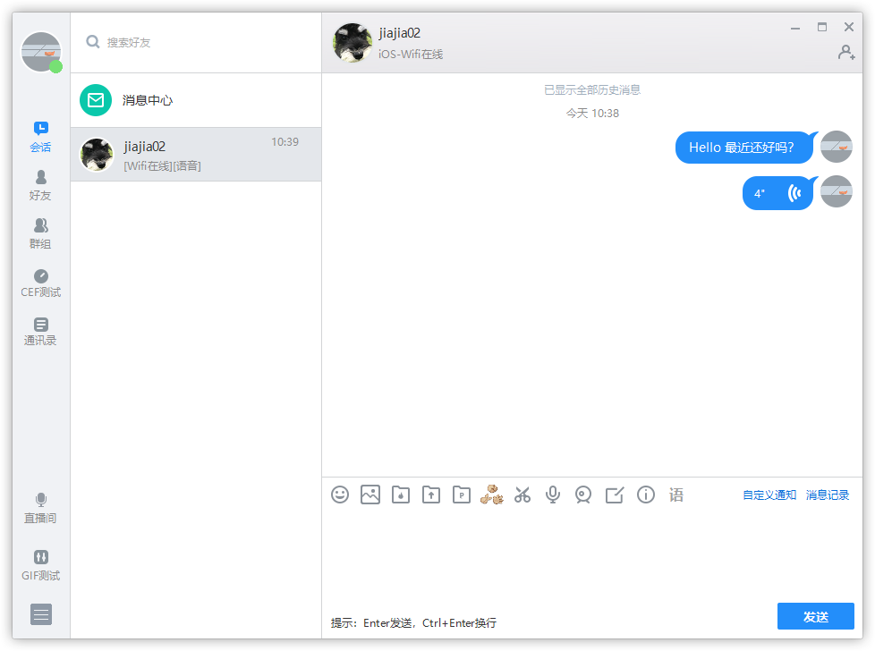

# NetEase IM PC Demo

网易云信 PC IM Demo 是基于[网易云信 PC SDK](https://yunxin.163.com/im-sdk-demo) 制作的即时通讯示例程序，UI 库使用 [NIM Duilib](https://github.com/netease-im/NIM_Duilib_Framework) 制作


## 预览



## 最低要求

 - CMake 3.10 或以上版本
 - Visual Studio 2017 或以上版本

## 开发步骤

NIM Demo 从 8.4.0 版本开始使用 CMake 管理工程结构，您需要下载安装 CMake 并安装到系统中：[https://cmake.org/download/](https://cmake.org/download/)

安装完成后，首先克隆项目到你的磁盘中：

```
git clone https://github.com/netease-im/NIM_PC_Demo.git --depth 1
```

执行如下命令进行工程初始化

```bash
# 初始化项目
cmake -B build -G"Visual Studio 15 2017" -T"v141_xp" -DCMAKE_BUILD_TYPE=Debug
```

执行如上命令后，会自动下载依赖的三方库文件并解压到工程目录下，如执行无误您将看到如下信息：

```bash
############# nim_win_demo ##############
-- Downloading third party libraries from http://yx-web.nos.netease.com/package/1619524144/nim_demo_build_libraries_x86_debug.zip
-- Current git tag: 8.4.0, commit count: 772, describe: 8.4.0-2-gbe6c7fea
############# core #############
############# base #############
############# duilib #############
############# shared #############
############# db #############
############# transfer file P2P #############
############# av_kit #############
############# rtc_kit #############
############# capture_image #############
############# image_view #############
############# nim_service #############
############# ui_kit #############
############# cef_module #############
############# cef_render #############
############# libcef_dll_wrapper #############
############# app_sdk #############
############# nim_demo #############
############# nim demo uninstaller #############
-- Configuring done
-- Generating done
-- Build files have been written to: C:/Code/nim_demo/build
```

您可以通过打开 build 目录下的 `nim_win_demo.sln` 来进行调试或通过 CMake 命令直接编译：

```bash
cmake --build build --config Debug --target install
```

编译完成后会自动拷贝程序到代码根目录的 bin 文件夹下：

```bash
Installing: C:/Jks/workspace/NeIM_Demo/pdb/render.pdb
Installing: C:/Jks/workspace/NeIM_Demo/bin/render.exe
Installing: C:/Jks/workspace/NeIM_Demo/pdb/nim_demo.pdb
Installing: C:/Jks/workspace/NeIM_Demo/bin/nim_demo.exe
Installing: C:/Jks/workspace/NeIM_Demo/pdb/uninstall.pdb
Installing: C:/Jks/workspace/NeIM_Demo/bin/uninstall.exe
```

如您需要编译 Release 版本，则将上面的命令中 Debug 修改为 Release 即可：

```bash
# 请确保当前在 build 目录下
cmake -B build -G"Visual Studio 15 2017" -T"v141_xp" -DCMAKE_BUILD_TYPE=Release
cmake --build build --config Release --target install
```

## 使用音视频 2.0 版本

Demo 支持使用音视频 2.0 能力来展示视频、音频通话场景，您可以在初始化 CMake 脚本时增加参数 `BUILD_WITH_NERTC_G2` 来开启该功能，如：

```
cmake . -B build -G"Visual Studio 2017" -T"v141_xp" -DBUILD_WITH_NERTC_G2=ON -DCMAKE_BUILD_TYPE=Debug
cmake --build build --config Debug --target install
```

## 交流

 - 遇到问题：关注[云信开发人员手册](https://dev.yunxin.163.com/)帮助您理解和使用云信 SDK 接口
 - 提交缺陷：在确保使用最新版本依然存在问题时请尽量以简洁的语言描述清楚复现该问题的步骤并提交 Issue
 - 功能建议：如果你有什么好的想法或者提案，欢迎提交 Issue 与我们交流
